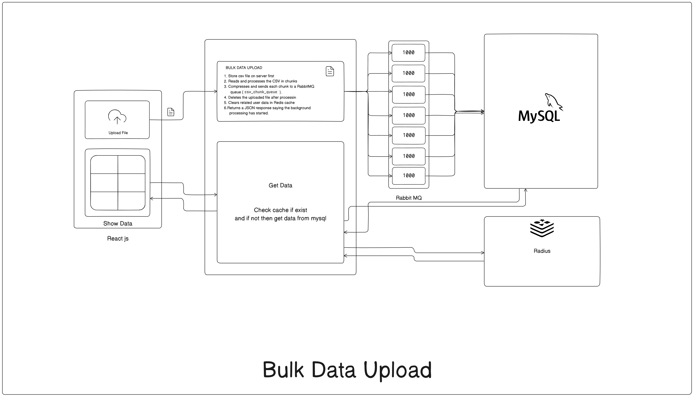
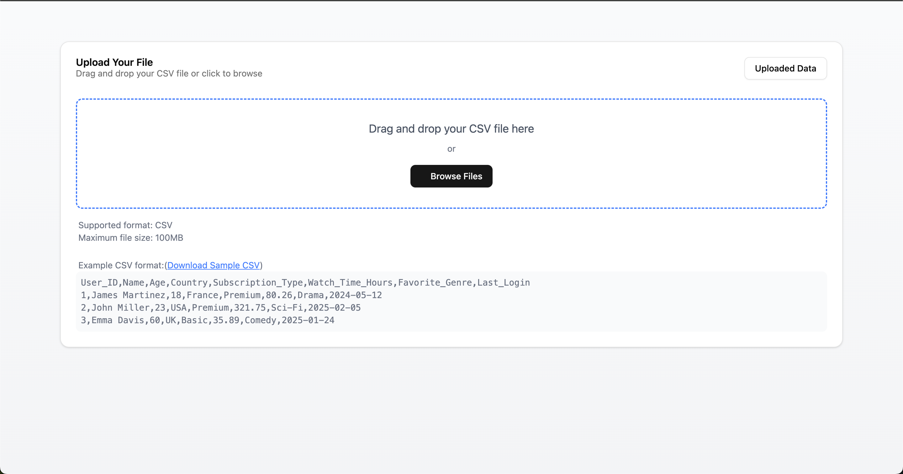
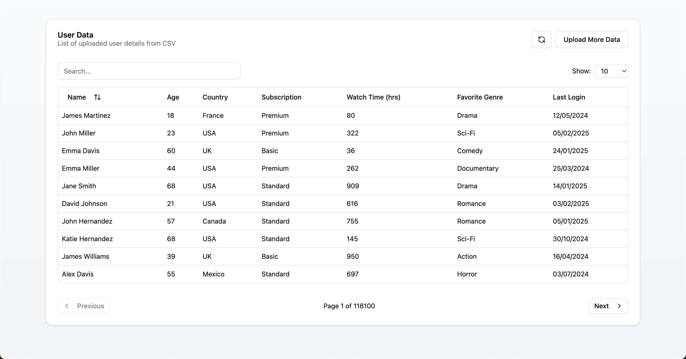

# User Bulk Data Upload Project







Hey there! This is a simple Node.js backend project for managing users with a CSV upload feature, MySQL database, Redis caching, and a RabbitMQ worker for processing data in the background. There's also a React frontend built with Vite to interact with the API. Here's how to get everything up and running.

## What's in This Project?
- **Backend**: Node.js with Express, Sequelize for MySQL, Redis for caching, RabbitMQ for queue processing, and Swagger for API docs.
- **Frontend**: A React app built with Vite for a fast development experience.
- **Features**: Upload CSV files with user data, process them in the background, and fetch users with pagination and search.

## Prerequisites
Before you start, make sure you have:
- Node.js
- MySQL (running locally or on a server)
- Redis (running locally or on a server)
- RabbitMQ (running locally or on a server)
- npm (comes with Node.js)

## Getting Started

### 1. Clone the Project
Grab the code from the repository:
```bash
git clone https://github.com/prakashsolanki28/bulk-upload.git
cd bulk-upload
```

### 2. Set Up the Backend

```bash
cd backend
```

1. **Install Backend Dependencies**  
   Navigate to the backend folder (root of the project) and install the packages:
   ```bash
   npm install
   ```

2. **Configure Environment Variables**  
   Create a `.env` file in the root folder and add the following:
   ```
   DB_HOST=localhost
   DB_USER=your_mysql_user
   DB_PASS=your_mysql_password
   DB_NAME=bulkdata
   PORT=5000
   ```
   Replace `your_mysql_user` and `your_mysql_password` with your MySQL credentials. The `DB_NAME` is the database name (e.g., `bulkdata`).

3. **Set Up the Database**  
   Make sure MySQL is running. Create a database called `bulkdata` (or whatever you set in `DB_NAME`):
   ```sql
   CREATE DATABASE bulkdata;
   ```
   The project uses Sequelize to sync the database schema automatically, so you don’t need to run any migrations.

4. **Start Redis and RabbitMQ**  
   Ensure Redis and RabbitMQ are running on your machine or server. For local setup:
   - **Redis**: Install and run Redis (default port: 6379).
     ```bash
     redis-server
     ```
   - **RabbitMQ**: Install and run RabbitMQ (default port: 5672).
     ```bash
     rabbitmq-server
     ```

5. **Start the Backend Server**  
   In the root folder, run:
   ```bash
   npm start
   ```
   The server will start on `http://localhost:5000` (or the port you set in `.env`). You’ll see logs like:
   ```
   MySQL DB connected
   Server running on port 5000
   Worker started...
   ```

6. **Check the API Docs**  
   Open `http://localhost:5000/docs` in your browser to see the Swagger API documentation.

### 3. Set Up the React Frontend


The React frontend is in a separate folder (e.g., `/frontend`). Here’s how to get it running:

1. **Navigate to the Frontend Folder**  
   ```bash
   cd frontend
   ```

2. **Install Frontend Dependencies**  
   ```bash
   npm install
   ```

3. **Start the React App**  
   The frontend uses Vite for a super fast dev server. Run:
   ```bash
   npm run dev
   ```
   This will start the React app, usually on `http://localhost:5173`. Open that URL in your browser to see the app.

4. **Using the Frontend**  
   The React app connects to the backend API (`http://localhost:5000/api/users`). You can:
   - Upload a CSV file with user data.
   - View a paginated list of users with search functionality.

### 4. How to Use the API
- **Upload Users**: Send a POST request to `/api/users/upload-users` with a CSV file. The file is processed in the background via RabbitMQ.
- **Get Users**: Send a GET request to `/api/users?page=1&limit=10&search=john` to fetch users with pagination and search.
- Check the Swagger docs at `/docs` for full details.

### 5. Troubleshooting
- **Backend won’t start?**  
   - Check if MySQL, Redis, and RabbitMQ are running.
   - Verify your `.env` file has the correct database credentials.
   - Look at the console for error messages (e.g., "Unable to connect to the DB").
- **Frontend not connecting to backend?**  
   - Ensure the backend is running on `http://localhost:5000`.
   - Check for CORS errors in the browser console. The backend already includes CORS middleware, but verify the API URL in your React app.
- **CSV processing stuck?**  
   - Confirm RabbitMQ is running and the worker is consuming messages (look for "Worker started..." in the logs).
   - Check the `/logs/failed_inserts.log` file for any failed database inserts.

### 6. Project Structure
- **Backend**:
  - `/src/models`: Database models (e.g., User).
  - `/src/routes`: API routes (e.g., userRoutes).
  - `/src/controllers`: Logic for handling requests.
  - `/src/workers`: RabbitMQ worker for CSV processing.
  - `/logs`: Logs for failed database inserts.
- **Frontend**:
  - `/frontend/src`: React components, API calls, and UI logic.
  - Built with Vite for fast development.

### 7. Notes
- The backend uses Redis to cache user data for 5 minutes to improve performance.
- The CSV upload splits data into chunks (1000 rows) and processes them via RabbitMQ to avoid overloading the server.
- The React app is lightweight and uses Vite, so it’s super fast to develop and test.

If you run into any issues or have questions, feel free to reach out! Happy coding! 🚀